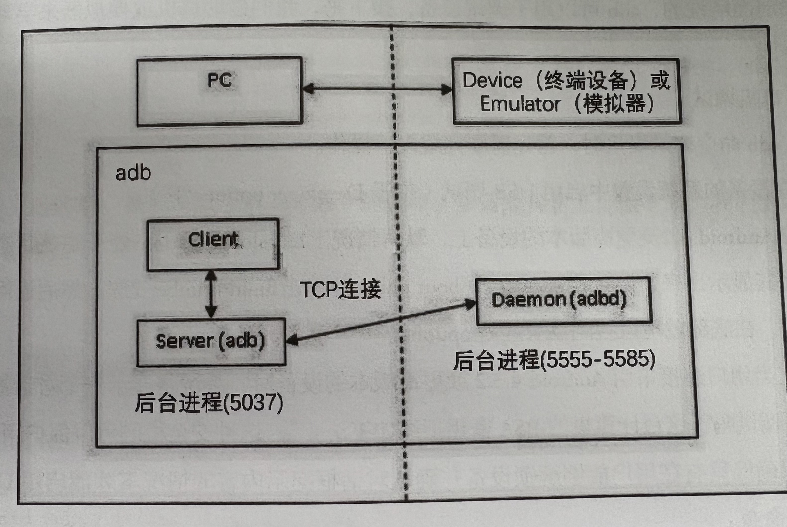

## 一、adb的作用

adb（Android Debug Bridge）是一个针对Android的调试桥，是一个命令行工具，可以与模拟器或者真机进行通信，方便开发者与测试人员与设备进行交互。


## 二、adb的工作原理

当启动一个adb客户端时，此客户端会首先检查是否已有运行的a代表、服务器进程。如果没有，adb客户端会自动启动一个adb服务器进程。当服务器启动时，adb客户端默认与TCP端口5037绑定，并且侦听从adb客户端发送的命令。所有adb客户端均使用端口5037与adb服务器进行通信。



## 三、adb常用命令

#### 1、查看adb的版本

```shell
adb version
```

### 2、连接或断开设备

需要借助`adb connect IP:Port`命令设定adb监听的IP地址以及对应端口

```shell
# 连接设备
adb connect IP:Port

# 断开设备
adb disconnect IP:Port
```

### 3、查看连接设备的信息

可以通过`adb devices`查看连接设备的信息

```shell
C:\Windows\system32>adb devices
List of devices attached
emulator-5554   device
```

> emulator-5554是监听设备的IP和端口号，device是设备名

### 4、adb shell

shell是Linux系统的用户界面，提供了用户与内核交互操作的接口。Android是基于Linux内核开发的，所以在Android中也可以使用shell命令

```shell
C:\Windows\system32>adb shell
star2qltechn:/ #
```

> 1、上述命令中 “/” 代表的是根目录，“#” 代表的是root权限
>
> 2、“$” 代表的是没有root权限，可以通过命令`adb root`获得root权限


如果当PC同时连接了多台设备，此时如果直接是使用`adb shell`命令就会报错，因为adb服务器不知道你是想操作哪一台手机。所以这种情况下，需要在使用`adb shell`命令时添加`-s`选项，指定要连接的设备

```shell
C:\Windows\system32>adb -s emulator-5554 shell
star2qltechn:/ #
```

### 5、安装App

从PC的指定目录安装apk文件

```shell
# 默认安装
adb install C:\Windows\android-pospal-release-3.6.5.1400.apk

# 覆盖安装
adb install -r C:\Windows\android-pospal-release-3.6.5.1400.apk

# 安装到指定设备
adb -s emulator-5554 install C:\Windows\android-pospal-release-3.6.5.1400.apk
```

> 如果App已经安装在设备中，直接使用默认安装会导致失败，因此需要先卸载App再安装，或者使用覆盖安装

### 6、卸载App

**卸载步骤**

> 1、先使用`adb shell`命令进入shell
>
> 2、再通过`cd`命令进入`/data/app/`目录下
>
> 3、然后通过`ls`命令获取当前目录下有哪些包名
>
> 4、执行命令`adb uninstall 包名`卸载app

```shell
# 1、先使用`adb shell`命令进入shell
C:\Windows\system32>adb shell

# 2、再通过`cd`命令进入`/data/app/`目录下
star2qltechn:/ # cd /data/app/

# 3、然后通过`ls`命令获取当前目录下有哪些包名
star2qltechn:/data/app # ls
cn.pospal.www.pospal_pos_android_new.pospal-pTGjZZhoVEk5N8YrvIW_Eg==
com.android.flysilkworm-GUVlbe_yogE0eZFcU7seUg==
com.chaoxing.mobile-X1otvO4N2821eeSF1yh_Yg==
io.appium.settings-uCsU3FJmuFRr9yBSmARCIA==
io.appium.uiautomator2.server-V3QojhzOhSj6Sc3xb3Xa3A==
io.appium.uiautomator2.server.test-aKvchSSSTiDZlGqfIJDyXQ==
star2qltechn:/data/app # ^D

# 4、执行命令`adb uninstall 包名`卸载app
C:\Windows\system32>adb uninstall cn.pospal.www.pospal_pos_android_new.pospal-pTGjZZhoVEk5N8YrvIW_EgD
```

### 7、推送文件和下载文件

```shell
# 将PC中的文件推送到Android设备中
adb push 本地文件地址 远端目录

# 将Android设备中的文件拖拽到本地
adb pull 远端目录 本地文件地址
```

**示例**

```shell
C:\Windows\system32>adb push d:\Users\Desktop\android-pad-pos-pospal-release-3.6.5.1400.apk /sdcard
d:\Users\Desktop\android-pad-pos-pospal-release-3.6.5.1400...le pushed, 0 skipped. 29.9 MB/s (71373065 bytes in 2.277s)
```

**注意点**

> 由于权限问题，远端文件不能直接拖拽到本地磁盘根目录，否则会报错

### 8、查看包名

```shell
# 查看设备上所有App的包名，会显示很多Android原生应用
adb shell pm list packages

# 只显示设备上第三方App的包名
adb shell pm list packages -3
```

### 9、查看Activity

```shell
# 查看当前处于活跃状态的App
adb shell dumpsys window|findstr CurrentFocus
```

**示例**

```shell
C:\Windows\system32>adb shell dumpsys window|findstr CurrentFocus
  mCurrentFocus=Window{bfd3895 u0 cn.pospal.www.pospal_pos_android_new.pospal/cn.pospal.www.pospal_pos_android_new.activity.loginout.AccountLoginActivity}
```

> 1、上述结果中“cn.pospal.www.pospal_pos_android_new.pospal”为App的包名
>
> 2、“cn.pospal.www.pospal_pos_android_new.activity.loginout.AccountLoginActivity”为App的Activity

### 10、启动、关闭adb服务

部分情况下，模拟器在运行一段时间后，adb服务可能会出现异常，这个时候需要关闭和启动adb服务

```shell
# 关闭 adb 服务
C:\Windows\system32>adb kill-server

# 启动 adb 服务
C:\Windows\system32>adb start-server
* daemon not running; starting now at tcp:5037
* daemon started successfully
```

### 11、 屏幕截图

```shell
# 对终端屏幕进行截图，并保存到设备的指定文件目录中
adb shell screencap /sdcard/screen.png

# 再使用pull命令将文件拉去到本地
```