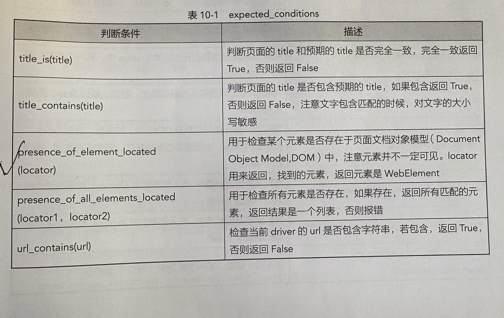
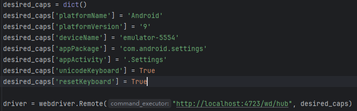
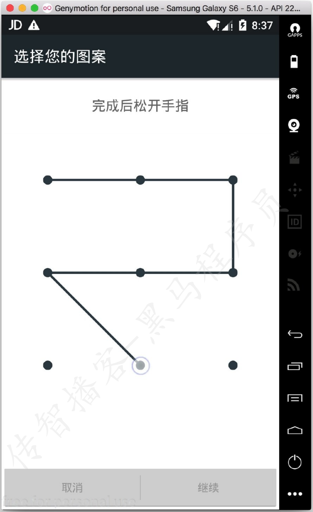
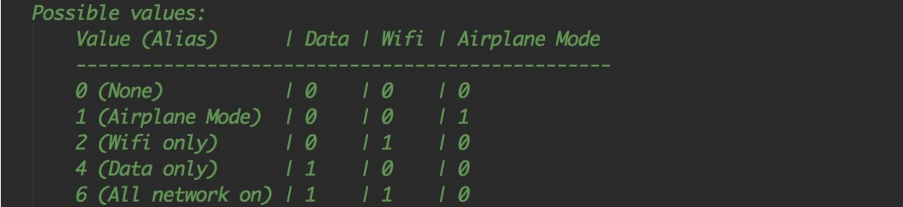
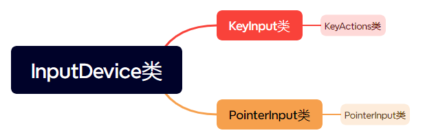
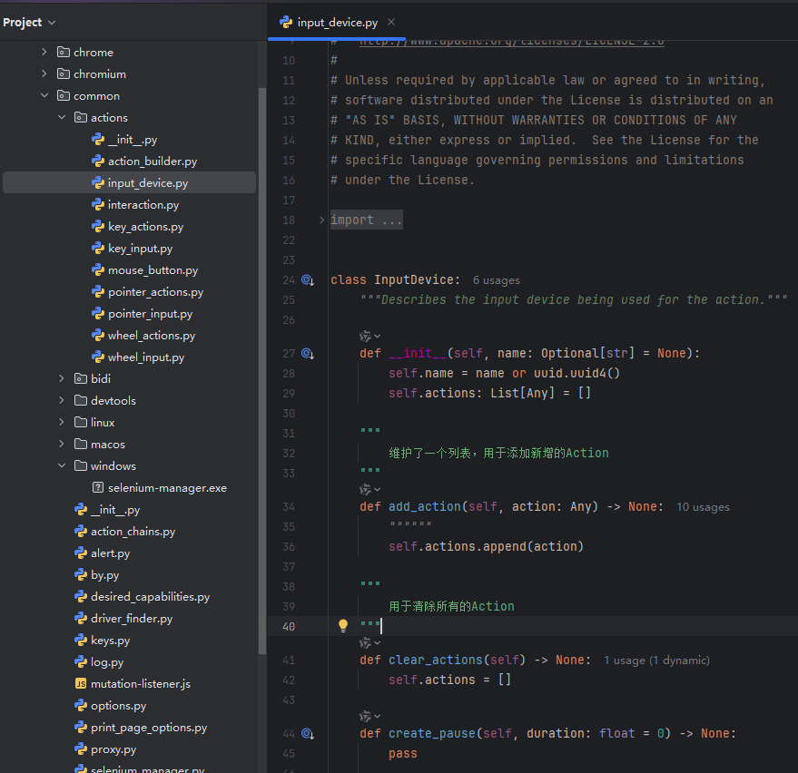
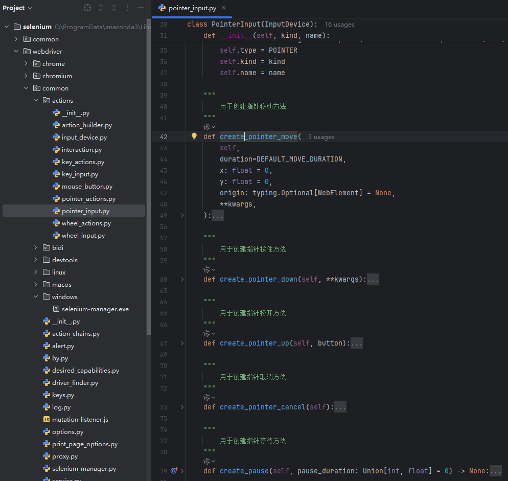
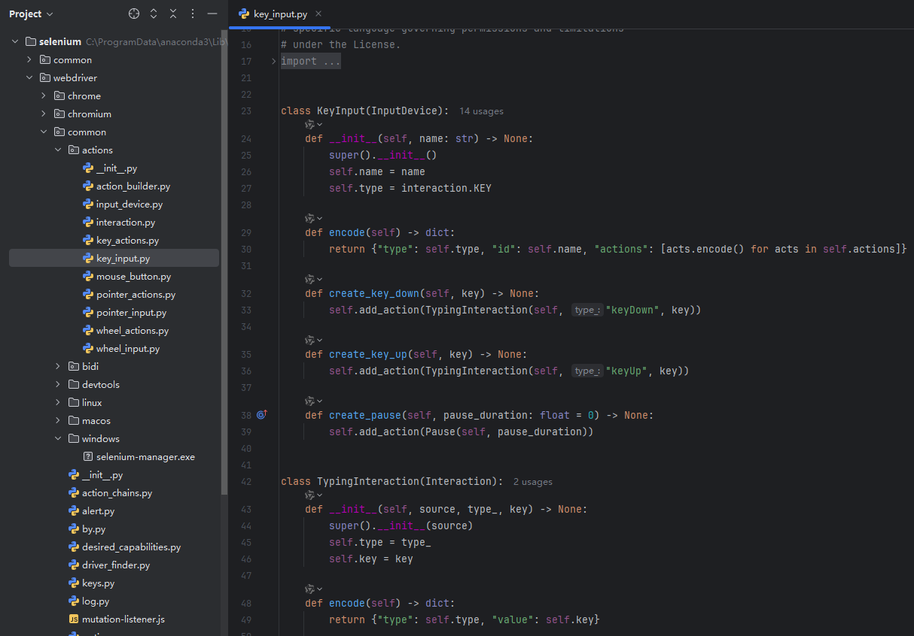
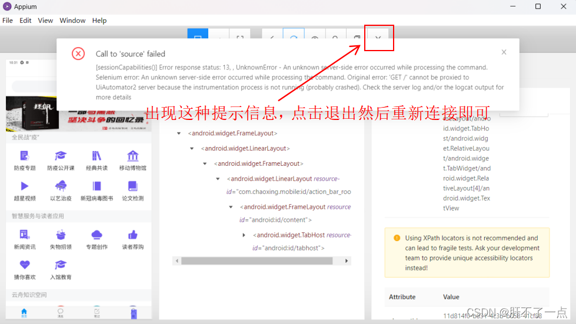
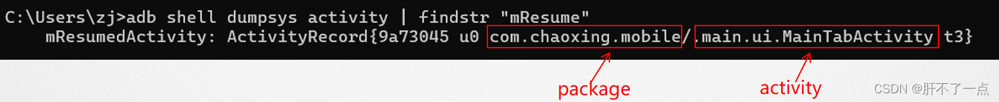

## 零、Appium简介

### 1、Appium运行原理

Android系统自带了自动化测试框架UIautomator。Appium框架并不是全新技术，而是封装了底层的UIautomator，并且通过“侵入”Android系统的驱动程序Bootstrap.jar调用UIautomator命令来进行自动化测试。Bootstrap.jar相当于是Android设备中的一个应用程序，它在手机上扮演TCP服务器的角色，具有传递消息和调度测试组件的作用。


## 一、Python + Appium环境搭建

https://blog.csdn.net/m0_74105684/article/details/136592906?spm=1001.2101.3001.6650.3&utm_medium=distribute.pc_relevant.none-task-blog-2%7Edefault%7EBlogCommendFromBaidu%7ERate-3-136592906-blog-106093849.235%5Ev43%5Epc_blog_bottom_relevance_base7&depth_1-utm_source=distribute.pc_relevant.none-task-blog-2%7Edefault%7EBlogCommendFromBaidu%7ERate-3-136592906-blog-106093849.235%5Ev43%5Epc_blog_bottom_relevance_base7&utm_relevant_index=6

## 二、Appium提供的基本函数

#### 1、与Appium Server建立连接

```python
caps = {
    "platformName": "Android",
    "deviceName": "emulator-5554",
    "appPackage": "com.chaoxing.mobile",
    "appActivity": ".main.ui.MainTabActivity",
    "noReset": True
}

# 与 Appium server 建立连接
    driver = webdriver.Remote("http://localhost:4723/wd/hub", caps)
```

#### 2、在当前页面启动另一个页面

```python
driver.start_activity("包名", "界面名")
```

#### 3、打开或关闭应用程序和驱动

```python
# 打开应用程序和驱动,launch_app()用于启动caps中指定的APP
driver.launch_app()

# 关闭应用程序和驱动，close_app()用于关闭caps中指定的APP
driver.close_app()

# 关闭应用程序
driver.quit()
```

#### 4、安装和卸载以及是否安装app

```python
# 安装app
# 参数： app_path: apk路径
driver.install_app(app_path)
```

```python
# 卸载app
# 参数： app_id: 应用程序包名
driver.remove_app(app_id)
```

```python
# 判断app是否已经安装
# 参数： app_id: 应用程序包名
# 返回值： 布尔类型，True为已安装，False为未安装
driver.is_app_install(app_id)
```

#### 5、将应用置于后台

```python
# app放置到后台一定时间后再回到前台，模拟热启动
# 参数：  seconds： 后台停留多少秒
driver.background_app(second)
```

#### 6、重启应用程序

**应用场景**

> 1、在自动化测试过程中，出现未知错误，尝试重启APP
>
> 2、快速将APP置为启动时的初始页面

```python
# 重启设备上的APP
driver.reset()
```

#### 7、激活或终止运行APP

**`activate_app(“包名”)`和`launch_app()`有什么区别？**

> 1、前者需要在括号中传递要启动的APP包名；后者针对cap中指定的APP，不需要传递参数
>
> 2、当时用driver.quit()退出时，使用activate_app()启动的APP不会关闭，而使用launch_app()启动的APP会被关闭

```python
# 启动指定的包名的APP
driver.activate_app("包名")
```

**终止运行APP的应用场景？**

用于关闭使用`activate_app("包名")`方法所启动的APP

```python
# 终止运行的APP
# 默认超时时间为500毫秒，单位为毫秒
driver.terminate_app(app_id="包名", timeout=600)
```

#### 8、获取APP状态

**应用场景**

在测试过程中，需要获取APP的运行状态

```python
# 传入包名，获取该APP的运行状态，返回一个状态值
state = driver.query_app_state("包名")
```

**注意点**

> 1、APP未安装，state=0
>
> 2、APP未启动，state=1
>
> 3、APP在后台挂起，state=2
>
> 4、APP在后台运行，state=3
>
> 5、APP在前台运行，state=4

**9、获取当前driver所连接的APP的包名和activity名**

```python
# 通过current_package()获取当前包，仅支持Android
driver.current_package()
```

```python
# 通过current_activity()获取当前activity
driver.current_activity()
```


## 三、UIAutomatorViewer的使用

#### 如何使用uiautomatorviewer获取元素的特征

1. 保证想要查看的元素在当前的屏幕上
2. 打开uiautomatorviewer工具
3. 点击左上角左数第二个按钮
4. 点击想要获取特征的元素
5. 查看工具左下角相关的特征信息


#### 使用uiautomatorviewer注意点

1. 命令行窗口不要关闭
2. 如果uiautomatorviewer闪退，则更换为jdk1.8
3. 点击第二个按钮的时候报错
   - 重启adb
     - `adb kill-server`
     - `adb start-server`


## 四、元素定位操作API

### 1、定位一个元素

**方法名**

```python
from selenium.webdriver.common.by import By

# 通过id定位一个元素
# 参数： id_value: 元素的resource-id属性值
# 返回值：定位到的单个元素
driver.find_element_by_id(id_value)   # 旧版本
driver.find_element(By.ID, id_value)	# 新版本
```

```python
# 通过class_name定位一个元素
# 参数： class_value： 元素的class属性
# 返回值：定位到的单个元素
driver.find_element_by_class_name(class_value)	# 旧版本
driver.find_element(By.CLASS_NAME, class_value)	# 新版本
```

```python
# 通过xpath定位一个元素
# 参数： xpath_value： 定位元素的xpath表达式
# 返回值： 定位到的单个元素
driver.find_element_by_xpath(xpath_value)	# 旧版本
driver.find_element(By.XPATH, xpath_value)	# 新版本
```


**例子**

```python
from appium import webdriver
import time
from selenium.webdriver.common.by import By
import schedule
import time

desired_caps = dict()
desired_caps['platformName'] = 'Android'
desired_caps['platformVersion'] = '9'
desired_caps['deviceName'] = 'emulator-5554'
desired_caps['appPackage'] = 'com.android.settings'
desired_caps['appActivity'] = '.Settings'

driver = webdriver.Remote("http://localhost:4723/wd/hub", desired_caps)
# 等待页面加载，可以根据实际情况调整等待时间
driver.implicitly_wait(10)

# 通过 id 定位放大镜按钮，点击
driver.find_element(By.ID, "com.android.settings:id/search_action_bar_title").click()
time.sleep(2)

# 通过 class_name 定位输入框，输入hello
driver.find_element(By.CLASS_NAME, "android.widget.EditText").send_keys("hello")
time.sleep(2)

# 通过 xpath 定位返回按钮，点击
driver.find_element(By.XPATH, "//android.widget.ImageButton[@content-desc='向上导航']").click()

# 关闭应用程序和驱动
driver.quit()
```


**注意点**

> 如果很多元素的“特征”相同，使用上述方法定位元素时，总是找到的是与之对应的第一个元素


### 2、定位一组元素

**应用场景**

和定位一个元素相同，但是如果想要批量的获取某个相同特征的元素，使用定位一组元素的方式更加方便


**方法名**

```python
from selenium.webdriver.common.by import By

# 通过id定位一组元素
# 参数： id_value: 元素的resource-id属性值
# 返回值：列表，定位到的一组元素
driver.find_elements_by_id(id_value)   # 旧版本
driver.find_elements(By.ID, id_value)	# 新版本
```


```python
# 通过class_name定位一组元素
# 参数： class_value： 元素的class属性
# 返回值：列表，定位到的一组元素
driver.find_elements_by_class_name(class_value)	# 旧版本
driver.find_elements(By.CLASS_NAME, class_value)	# 新版本
```

```python
# 通过xpath定位一组元素
# 参数： xpath_value： 定位元素的xpath表达式
# 返回值： 列表，定位到的一组元素
driver.find_elements_by_xpath(xpath_value)	# 旧版本
driver.find_elements(By.XPATH, xpath_value)	# 新版本
```


**例子**

```python
from time import sleep

from appium import webdriver
import time
from selenium.webdriver.common.by import By
import schedule
import time

desired_caps = dict()
desired_caps['platformName'] = 'Android'
desired_caps['platformVersion'] = '9'
desired_caps['deviceName'] = 'emulator-5554'
desired_caps['appPackage'] = 'com.android.settings'
desired_caps['appActivity'] = '.Settings'

driver = webdriver.Remote("http://localhost:4723/wd/hub", desired_caps)
# 等待页面加载，可以根据实际情况调整等待时间
driver.implicitly_wait(10)

# 定位一组元素
# 通过 id 的形式，获取所有 id 为 “com.android.settings:id/dashboard_tile” 的元素，并且打印文字内容
titles = driver.find_elements(By.ID, "com.android.settings:id/dashboard_tile")
print(titles)
print(len(titles))
time.sleep(2)

# 通过 class_name 的形式，获取所有 class_name 为 “android.widget.LinearLayout” 的元素
LinearLayouts = driver.find_elements(By.CLASS_NAME, "android.widget.LinearLayout")
print(len(LinearLayouts))
time.sleep(2)

# 通过 xpath 的形式，获取所有包含“设”的元素，并打印其文字内容
elems = driver.find_elements(By.XPATH, "//*[contains(@text, '设')]")
print(len(elems))
for elem in elems:
    print(elem.text)
time.sleep(2)

# 关闭应用程序和驱动
driver.quit()
```

### 3、XPath定位策略（方式）

> 1、路径定位
>
> 2、利用元素属性定位
>
> 3、属性与逻辑结合定位
>
> 4、层级与属性结合定位

#### 3.1 路径定位（相对路径、绝对路径）

- 绝对路径：从最外层元素到指定元素之间所有经过元素层级的路径

> 1). 绝对路径以/html根节点开始，使用/来分隔元素层级；
>
> 如：/html/body/div/fieldset/p[1]/input
>
> 2). 绝对路径对页面结构要求比较严格，不建议使用

- 相对路径：匹配任意层级的元素，不限制元素的位置

> 1). 相对路径以//开始
>
> 2). 格式：//input 或者 //*

#### 3.2 利用元素属性

**格式**

```python
#	说明：通过使用元素的属性信息来定位元素
#	格式：//input[@id='userA'] 或者 //*[@id='userA']
```

#### 3.3 属性与逻辑结合

**格式**

```python
#	说明：解决元素之间个相同属性重名问题
#	格式：//*[@name='tel' and @class='tel']
```

#### 3.4 层级与属性结合

**格式**

```python
#	说明：如果通过元素自身的信息不方便直接定位到该元素，则可以先定位到其父级元素，然后再找到该元素
#	格式：//*[@id='p1']/input
```

#### 3.5 XPATH延伸

```python
//*[text()="xxx"] 文本内容是xxx的元素
//*[contains(@attribute,'xxx')] 属性中含有xxx的元素
//*[starts-with(@attribute,'xxx')] 属性以xxx开头的元素
```

### 4、定位元素的注意点（了解）

**示例**

> 使用 find_element() 或 find_elements() 的方法，分别传入一个没有的“特征”会是什么结果呢？

**核心代码**

```python
driver.find_element(By.ID, "xxxxxxx")
driver.find_elements(By.ID, "xxxxxxx")
```

**出现现象**

> 1、在 find_element() 中会出现错误 “NoSuchElementError: An element could not be located on the page using the given search parameters.”
>
> 2、在 find_elements() 中则不会出现错误，而是直接返回一个空列表


## 五、元素等待

### **应用场景**

可能由于一些原因，我们想找的元素并没有立刻出来，此时如果直接定位可能会报错

1. 由于网络速度原因
2. 服务器处理请求原因
3. 电脑配置原因

### 概念

WebDriver 定位页面元素时如果未找到，会在指定时间内一直等待的过程，等待元素出来之后，再来定位，防止报错

> 元素等待一共分为两个类型
>
> 1、隐式等待
>
> 2、显式等待

### 1、隐式等待

**应用场景**

针对所有定位元素的超时时间设置为同一个值的时候

**作用**

- 在设置了超时时间之后，后续所有的定位元素的方法都会在这个时间内等待元素的出现
- 如果出现了，直接进行后续操作（比如隐式等待设置了10s，而程序在第5s就定位到了元素，那么此时会立刻进行后续操作，而**不是等待时间耗尽**）
- 如果没有出现，输出 NoSuchElementError 异常

**方法参数解释**

```python
# 参数： timeout: 超时的时长，单位：秒
driver.implicitly_wait(timeout)
```

**示例**

> 在10s 内，在“设置”程序中的文本框，如果找到则点击，如果找不到则观察对应错误信息

```python
driver = webdriver.Remote("http://localhost:4723/wd/hub", desired_caps)

# 设置隐式等待 10s
driver.implicitly_wait(10)

# 通过 xpath 定位返回按钮，点击
print("准备找返回按钮并点击")
driver.find_element(By.CLASS_NAME, "android.widget.EditText").send_keys("hello")
print("点完了")
```

### 2、显式等待

**应用场景**

针对所有定位元素的超时时间设置为不同值的时候

**步骤**

1. 导包 `from selenium.webdriver.support.wait import WebDriverWait`
2. 创建 `WebDriverWait` 对象
3. 调用 `WebDriverWait` 对象中 `until` 方法

**方法参数解释**

```python
# 参数： 
#	driver： 必选参数，驱动对象
#	timeout： 必选参数，超时的时长，单位：秒
#	poll_frequency： 可选参数，检测间隔时间，默认为0.5秒
#   ignored_exceptions：	如果在调用until()或until_not()的过程中抛出的是该参数中的异常，则不中断代码，否则抛出异常，默认为None
# 返回值：
#	webDriverwait 对象
webDriverwait(driver, timeout, poll_frequency=0.5, ignored_exceptions=None)
```

**webDriverwait对象一共提供了2种显式等待方法：**

1. `until(self, method, message='')`在规定时间内，代码每隔一段时间就调用一次该方法，直到`until`的返回值不为False，异常信息为`message`
2. `until_not(self, method, message='')`在规定时间内，代码每隔一段时间就调用一次该方法，直到`until_not`的返回值为False，异常信息为`message`

**示例**

> 在 25 秒内，每 5 秒查询一次在“设置”程序中的文本框元素，如果找到则输入文本，如果找不到则报错

```python
from selenium.webdriver.support.wait import WebDriverWait

#   显式等待 25s
print("准备找返回按钮并点击")
wait = WebDriverWait(driver, 25, 5)
back_button = wait.until(lambda x: x.find_element(By.CLASS_NAME, "android.widget.EditText"))  #   这里的“x”等价于“driver”
back_button.send_keys("hello")
print("点完了")
```

### expected_conditions模块

selenium中的expected_conditions模块提供了一系列的可用于判断的条件，可以和`until()`方法搭配使用



**示例1**

> 判断页面元素能否存在？

```python
# 用于检查某个元素是否存在于页面文档对象模型（DOM）中，注意元素不一定可见。locator用于返回找到的元素，返回元素是WebElement
presense_of_element_located(locator: [str, str])
```

```python
# 检查“用户名”输入框元素是否存在
try:
    ele = WebDriverWait(driver, 10, 0.5, None).until(EC.presence_of_element_located((By.ID, "cn.pospal.www.pospal_pos_android_new.pospal:id/account_tv")))
    ele.clear()
    ele.send_keys("2222")
except Exception as e:
    raise e
finally:
    sleep(2)
```

**示例2**

> 判断元素是否在DOM中存在并且可见

```python
# 用于检查某个元素是否存在于页面文档对象模型（DOM）中，且元素可见。locator用于返回找到的元素，返回元素是WebElement
visibility_of_element_located(locator: [str, str])
```

```python
# 检查“密码”输入框元素是否存在在DOM中，且元素一定可见
try:
    ele = WebDriverWait(driver, 10, 0.5, None).until(EC.visibility_of_element_located((By.ID, "cn.pospal.www.pospal_pos_android_new.pospal:id/password_tv")))
    ele.clear()
    ele.send_keys("3333")
except Exception as e:
    raise e
finally:
    sleep(2)
```

**示例3**

> 判断页面元素是否可见并且可单击

```python
# 判断 locator是否可见并且可单击，若是，返回True，否则返回False
element_to_be_clickable(locator: [str, str])
```

```python
# 检查“登录”按钮元素是否可见并且可以单击
try:
    ele = WebDriverWait(driver, 10, 0.5, None).until(EC.element_to_be_clickable((By.ID, "cn.pospal.www.pospal_pos_android_new.pospal:id/login_btn")))
    ele.click()
except Exception as e:
    raise e
finally:
    sleep(2)
```

**示例4**

> 借助lambda表达式来自定义等待条件

```python
# 自定义显式等待条件，查找并点击“账号+工号登录”的按钮
try:
    ele = WebDriverWait(driver, 10, 0.5, None).until(lambda x: x.find_element(By.ID, "cn.pospal.www.pospal_pos_android_new.pospal:id/account_cashier_login_ll"))
    ele.click()
except Exception as e:
    raise e
finally:
    sleep(2)
```


### 隐式等待存在的问题

#### 1、隐式等待会减缓测试速度：

当某个元素不存在时，会一直等待直到时间耗尽才报告无法找到该元素，导致测试速度缓慢

#### 2、隐式等待会干扰显式等待：

**2.1 隐式等待会与显式等待时间叠加，从而导致显式等待的响应时间延长**

```python
"""
	由于隐式等待的存在，显式等待可能超过5秒（每次轮询会耗费隐式等待的时间）
"""
# 设置隐式等待为10秒
driver.implicitly_wait(10)

# 显式等待为5秒
WebDriverWait(driver, 5).until(EC.presence_of_element_located((By.ID, "some_element")))
```

**2.2 查找失败导致显式等待失效，隐式等待会使得显式等待的条件检查延后，特别是当元素不存在时，显式等待无法快速返回**

```python
"""
	尽管显式等待设置了2秒超时，但由于隐式等待设置为5秒，程序可能耗时更久
"""
# 设置隐式等待为5秒
driver.implicitly_wait(5)

# 使用显式等待检查某个条件
WebDriverWait(driver, 2).until(EC.presence_of_element_located((By.ID, "non_existent_element")))
```

**解决方案**

- 如果需要使用显式等待，建议在需要显式等待的上下文临时禁用隐式等待

```python
driver.implicitly_wait(0)  # 禁用隐式等待
WebDriverWait(driver, 10).until(EC.presence_of_element_located((By.ID, "some_element")))
driver.implicitly_wait(5)  # 恢复隐式等待
```

### 显式等待和隐式等待的选择

- 作用于：
  - 显式等待为单个元素有效，隐式等待为全局元素
- 方法：
  - 显示等待方法封装在 `WebDriverWait` 类中，而隐式等待则直接，而隐式等待则直接通过 `driver` 实例化对象调用
- 关于 `sleep` 的形式？
  - `sleep` 是固定死的一个时间，不推荐
  - 元素等待可以让元素出来的第一时间进行操作，`sleep` 可能会造成不必要的时间浪费


## 六、元素操作API

### 1、点击元素

**方法名**

```python
# 对 element 按钮进行点击操作
element.click()
```

**示例**

> 1、打开“设置”
>
> 2、点击放大镜按钮

**核心代码**

```python
driver.find_element(By.ID, "com.android.settings:id/search_action_bar_title").click()
```

### 2、输入和清空输入框内容

**方法名**

```python
# 对 element 输入框进行输入操作
# 参数：
#	value: 输入的内容
element.send_keys(value)
# 对 element 输入框进行输入操作
element.clear()
```

**示例**

> 1、打开“设置”
>
> 2、点击放大镜
>
> 3、输入“hello”
>
> 4、暂停2秒
>
> 5、清空所有文本内容
>
> 6、暂停5秒
>
> 7、输入“你好”

**核心代码**

```python
# 定位一个元素
# 通过 id 定位放大镜按钮，点击
driver.find_element(By.ID, "com.android.settings:id/search_action_bar_title").click()
time.sleep(2)

# 通过 class_name 定位输入框，输入hello
driver.find_element(By.CLASS_NAME, "android.widget.EditText").send_keys("hello")
time.sleep(2)

# 通过 class_name 定位输入框，清空输入框
driver.find_element(By.CLASS_NAME, "android.widget.EditText").clear()
time.sleep(2)

# 通过 class_name 定位输入框，输入"你好"
driver.find_element(By.CLASS_NAME, "android.widget.EditText").send_keys("你好")
time.sleep(2)
```

**注意点**

> 默认输入中文无效，但不会报错，需要在“前置代码”中增加两个参数

```python
desired_caps['unicodeKeyboard'] = True
desired_caps['resetKeyboard'] = True
```



### 3、获取元素的文本内容

**属性名**

```python
# 获取 element 控件的文本内容
# 返回值： 控件的文本内容
element.text
```

**示例**

> 1、打开“设置”
>
> 2、获取所有 resource-id 为 “com.android.settings:id/dashboard_tile” 的元素，并打印其文字内容

核心代码

```python
# 获取所有 resource-id 为 “com.android.settings:id/dashboard_tile” 的元素，并打印其文字内容
elems = driver.find_elements(By.ID, "com.android.settings:id/dashboard_tile")
for elem in elems:
    print(elem.text)
```

### 4、获取元素的位置和大小

**属性名**

```python
# 获取element的位置
# 返回值： 字典，x为元素的x坐标，y为元素的y坐标
element.location

# 获取element的大小
# 返回值： 字典，width为宽度，height为长度
element.size
```

**示例**

> 1、打开“设置”
>
> 2、获取放大镜的位置和大小

**核心代码**

```python
#  获得放大镜按钮元素的位置和大小
button = driver.find_element(By.ID, "com.android.settings:id/search_action_bar_title")
print(button.location)
print(button.size)
```

### 5、获取元素的属性值

**方法名**

```python
# 对element进行点击操作
# 参数： value： 要获取的属性名
# 返回值： 根据属性名得到的属性值
element.get_attribute(value)	# value： 元素的属性名
```

**示例**

> 1、打开“设置”
>
> 2、获取放大镜元素
>
> 3、使用 get_attribute() 方法获取元素的 enabled、text、content-desc、resource-id 等属性

**核心代码**

```python
# 使用 get_attribute() 方法获取元素的 enabled、text、content-desc、resource-id 等属性
button = driver.find_element(By.ID, "com.android.settings:id/search_action_bar_title")
print(button.get_attribute("enabled"))
print(button.get_attribute("text"))
print(button.get_attribute("content-desc"))
print(button.get_attribute("resource-id"))
```

### 6、判断元素是否存在

使用`is_displayed()`方法，可以判断元素是否存在，该方法返回一个布尔值，True代表目标元素存在，False代表目标元素不存在。

```python
# 通过id定位“我的”元素
ele = driver.find_element(By.ID, "元素id")
# 输出元素是否可见结果
print(ele.is_displayed())
```

### 7、判断元素是否可用

使用`is_enabled()`方法，可以判断元素是否可用

```python
# 通过id定位“我的”元素
ele = driver.find_element(By.ID, "元素id")
# 输出元素是否可用
print(ele.is_enabled())
```

### 8、判断元素是否被选中

使用`is_selected()`方法，可以判断元素是否被选中

```python
# 通过id定位“我的”元素
ele = driver.find_element(By.ID, "元素id")
# 输出元素是否被选中
print(ele.is_selected())
```


## 七、滑动和拖拽事件

### **应用场景**

我们在做自动化测试的时候，有些按钮是需要滑动几次屏幕后才会出现，此时，我们需要使用代码模拟手指滑动

### 1、swipe滑动事件

**方法名**

```python
# 从一个坐标位置滑动到另一个坐标位置，只能是两个点之间的滑动
# 参数：
#	start_x：	起点x轴坐标
#	start_y：	起点y轴坐标
#	end_x：		终点x轴坐标
#	end_y：		终点y轴坐标
#	duration：	滑动这个操作一共持续的时间长度，单位：ms
driver.swipe(start_x, start_y, end_x, end_y, duration=None)
```

示例**1**

> 模拟手指从（100,1000），滑动到（100,500）的位置

**核心代码**

```python
driver.swipe(100, 1000, 100, 500)
```

示例**2**

> 模拟手指从（100,1000），滑动到（100,100）的位置

**核心代码**

```python
driver.swipe(100, 1000, 100, 100)
```

示例**1**

> 模拟手指从（100,1000），滑动到（100,100）的位置，持续时间5秒

**核心代码**

```python
driver.swipe(100, 1000, 100, 100, 5000)
```

**结论**

> 1、距离相同时，持续时间越长，惯性越小，滑动距离越短
>
> 2、持续时间相同时，手指滑动距离越大，实际滑动的距离也就越大

### 2、scroll滑动事件

**概念**

从一个元素滑动到另外一个元素，直到页面自动停止

**方法名**

```python
# 从一个元素滑动到另一个元素，直到页面自动停止
# 参数：
#	origin_el：		滑动开始的元素
#	destination_el：	滑动结束的元素
driver.scroll(origin_el, destination_el)
```

**示例**

> 从“存储”滑动到“电池”

**核心代码**

```python
#   从“存储”滑动到“电池”
save = driver.find_element(By.XPATH, "//*[@text='存储']")
bettary = driver.find_element(By.XPATH, "//*[@text='电池']")
driver.scroll(save, bettary)
```

**小结**

> 1、不能设置持续时间
>
> 2、惯性很大

### 3、drag_and_drop拖拽事件

**概念**

从一个元素滑动到另一个元素，第二个元素替代第一个元素原本屏幕上的位置

**方法名**

```python
# 从一个元素滑动到另一个元素，第二个元素替代第一个元素原本屏幕上的位置
# 参数：
#	origin_el：		滑动开始的元素
#	destination_el：	滑动结束的元素
driver.drag_and_drop(origin_el, destination_el)
```

**示例**

> 从“存储”滑动到“电池”

**核心代码**

```python
#   从“存储”滑动到“电池”
save = driver.find_element(By.XPATH, "//*[@text='存储']")
bettary = driver.find_element(By.XPATH, "//*[@text='电池']")
driver.drag_and_drop(save, bettary)
```

**小结**

> 1、不能设置持续时间
>
> 2、没有惯性

### 滑动和拖拽时间的选择

滑动和拖拽无非就是考虑是否有“惯性”，以及传递的参数是“元素”还是“坐标”

可以分为以下四种情况：

- 有惯性，传入元素
  - scroll
- 无惯性，传入元素
  - drag_and_drop
- 有惯性，传入坐标
  - swipe，并且设置较短的 duration 时间
- 无惯性，传入坐标
  - swipe，并且设置较长的 duration 时间


## 八、高级手势TouchAction（Appium2.0后被废除）

### 应用场景

TouchAction可以实现一些针对手势的操作，比如滑动、长按、拖动等。我们可以将这些基本手势组合成一个相对复杂的手势。比如，我们解锁手机或者一些应用软件都有手势解锁这种方式。

### 使用步骤

1. 创建TouchAction对象
2. 通过对象调用想要执行的手势
3. 通过 perform()执行动作

**注意点**

> 所有手势都要通过执行 perform（）函数才会运行

### 1、轻敲操作

**应用场景**

模拟手指对某个元素或坐标按下并快速抬起

**方法名**

```python
#	模拟手指对某个元素或坐标按下并快速抬起
# 参数：
#		element：元素
#		x：x 坐标
#		y：y 坐标
TouchAction(driver).tap(element=None, x=None, y=None).perform()
```

**示例**

> 1、打开“设置”
>
> 2、轻敲“WLAN”

核心代码

```python
el = driver.find_element(By.XPATH, "//*[contains(@text, "WLAN")]")
TouchAction(driver).tap(el).perform()
```

### 2、按下和抬起操作

**应用场景**

模拟手指一直按下，模拟手指抬起，可以用来组合成轻敲或长按的操作

**方法名**

```python
#	模拟手指对元素或坐标的按下操作
# 参数：
#		element：元素
#		x：x 坐标
#		y：y 坐标
TouchAction(driver).press(el=None, x=None, y=None).perform()
```

```python
#	模拟手指对元素或坐标的抬起操作
TouchAction(driver).release().perform()
```

**示例1**

> 使用坐标的形式按下WLAN（650, 650），2秒后，按下（650,650）的位置，并抬起

核心代码

```python
TouchAction(driver).press(x=650, y=650).perform()
time.sleep(2)
TouchAction(driver).press(x=650, y=650).release().perform()
```

### 3、等待操作

**应用场景**

模拟手指等待，比如按下后等待5秒再抬起

**方法名**

```python
# 模拟手指暂停操作
#	参数：
#		ms：暂停的毫秒数
TouchAction(driver).wait(ms=0).perform
```

**示例**

> 使用坐标的形式点击WLAN（650， 650），2秒后，按下（650， 650）的位置，暂停2秒，并抬起

```python
TouchAction(driver).tap(x=650, y=650).perform()
time.sleep(2)
TouchAction(driver).press(x=650, y=650).wait(2000).release().perform()
```

### 4、长按操作

**应用场景**

模拟手指对元素或坐标的长按操作。比如，长按某个按钮弹出菜单

**方法名**

```python
#	模拟手指对元素或坐标的长按操作
#	参数：
#		element：元素
#		x：x 坐标
#		y：y 坐标
#		duration：长按时间，毫秒
TouchAction(driver).long_press(el=None, x=None, y=None, duration=1000).perform()
```

**示例**

> 使用坐标的形式点击WLAN（650， 650），2秒后，长按（650， 650）的位置持续2秒

**核心代码**

```python
TouchAction(driver).tap(x=400, y=400).perform()
time.sleep(2)
TouchAction(driver).long_press(x=400, y=400, duration=2000).release().perform()
```

### 5、移动操作

**应用场景**

模拟手指移动移动操作，比如，手势解锁需要先按下，再移动

**方法名**

```python
#	模拟手指对元素或坐标的移动操作
#	参数：
#		element：元素
#		x：x 坐标
#		y：y 坐标
TouchAction(driver).move_to(el=None, x=None, y=None).perform()
```

**示例**

> 在手势解锁中，画一个如下图的案例
>
> 

**核心代码**

```python
TouchAction(driver).press(x=246, y=857).move_to(x=721, y=867).release().perform()
```

## 九、手机操作API

### 1、获取手机分辨率

**应用场景**

自动化测试可能会需要根据当前设备的屏幕分辨率来计算一些点击或者滑动的坐标

**方法名**

```python
#	获取手机分辨率
driver.get_window_size()
```

**示例**

> 输出当前设备的屏幕分辨率

核心代码

```python
print(driver.get_window_size())
```

执行结果

> {'height': 800, 'width': 480}

### 2、手机截图

**应用场景**

有些自动化的操作可能没有反应，但是不会报错。此时我们就可以将操作厚的关键情况，截图保留

**方法名**

Appium一共提供了4种截图方法：

```python
# filename参数非必传参数，如果不传该参数，则方法将直接保存屏幕截图到当前脚本所在目录
driver.save_screenshot("homepage.png")
```

```python
# get_screenshot_as_file(filename)，将截图保存到指定目录
driver.get_screenshot_as_file(r"d:\AA\homepage.png")
```

```python
# get_screenshot_as_png()，以二进制数据的形式获取当前窗口的截图
result = driver.get_screenshot_as_png()
```

```python
# get_screenshot_as_base64()，以Base64编码字符串的形式获取当前窗口的截图
result = driver.get_screenshot_as_base64()
```

**示例**

> 1、打开设置页面
>
> 2、截图当前页面保存到当前目录，命令为screen.png

**核心代码**

```python
driver.get_screenshot_as_file("screen.png")
```

### 3、获取和设置手机网络

**应用场景**

视频应用在使用流量看视频的时候，大部分都会提示用户正在是否继续播放。作为测试人员，我们可能需要用自动化的形式来判断是否有对应的提示。即，用流量的时候应该有提示，不用流量的时候应该没有提示。

**3.1 获取手机网络**

**属性名**

```python
# 获取手机网络
driver.network_connection
```

**示例**

> 获取当前网络类型，并打印

**核心代码**

```python
print(driver.network_connection)
```

**执行结果**

> 6

**结果对照**



3.2 **设置手机网络**

**方法名**

```python
# 设置手机网络
# 参数：
# connectionType：网络类型
driver.set_network_connection(connectionType)
```

**示例**

> 设置当前设备为飞行模式

**核心代码**

```python
driver.set_network_connection(1)
```

**执行结果**

> 设备变为飞行模型

### 4、发送键到设备

**应用场景**

模拟按 “返回键” “home键” 等等操作，比如，很多应用有按两次返回键退出应用的功能，如果这个功能需要我们做自动化，那么一定会用到这个方法。

**方法名**

```python
# 发送键到设备
# 参数：
# keycode：发送给设备的关键代码
# metastate：关于被发送的关键代码的元信息，一般为默认值
driver.press_keycode(keycode, metastate=None)
```

**注意点**

> 按键对应的编码，可以在百度搜索关键字 “android keycode”
>
> 例如：https://blog.csdn.net/feizhixuan46789/article/details/16801429

**示例**

> 点击三次音量加，再点击返回，再点击两次音量减

**核心代码**

```python
driver.press_keycode(24)
driver.press_keycode(24)
driver.press_keycode(24)
driver.press_keycode(4)
driver.press_keycode(25)
driver.press_keycode(25)
```

### 5、操作手机通知栏

**应用场景**

测试即时通信类软件的时候，如果 A 给 B 发送一条消息，B 的通知栏肯定会显示对应的消息。我们想通过通知栏来判断 B 是否收到消息，一定要先操作手机的通知栏。

**方法名**

```python
# 打开手机通知栏
driver.open_notifications()
```

**注意点**

> appium官方并没有为我们提供关闭通知的api，那么现实生活中怎么关闭，就怎样操作就行，比如，手指从下往上滑动，或者，按返回键

**示例**

> 打开通知栏，两秒后，关闭通知栏

**核心代码**

```python
driver.open_notifications()
time.sleep(2)
driver.press_keycode(4)
```

### 6、提交操作

在Hybrid App的Web页面中，如果页面元素是submit类型的按钮，则我们可以借助submit()方法让该按钮执行提交动作，效果类似于使用click()方法。注意，只有type类型为submit的元素才可以使用submit()方法。

```python
# 对于submit按钮，可以使用submit()方法
driver.find_element(By.ID, 'su').submit()
```

### 7、屏幕息屏、亮屏

Appium提供了以下3种方法来控制屏幕息屏、亮屏和屏幕状态

- `lock(seconds=None)`：设置屏幕息屏，相当于单击电源键熄灭屏幕。seconds参数表示息屏时间，单位为秒，默认为None
- `unlock()`：设置屏幕亮屏
- `is_locked()`：判断屏幕状态

```python
# 设置锁屏3秒
driver.lock(3)
# 3秒结束后，自动亮屏，这里等待3秒等待屏幕亮屏，并输出屏幕状态
time.sleep(3)
print(driver.is_locked())
```

## 十、Appium高级操作

### 1、W3C Actions

#### 1.1 W3C Actions简介

移动端的交互比Web端更加丰富，除了常见的单击、输入外，还有长按、滑动、摇晃、多指触控等。在Appium2.0之前，在移动端设备上的触屏操作——单点触控和多点触控分别由`TouchAction`和`Multiaction`实现。但在Appium2.0之后，这两个类被W3C Actions所替代。

W3C Actions是符合W3C协议的Actions。在Selenium4.0中，使用的是W3C WebDriver通信协议规范，而Appium是基于Selenium开发的，因此新版的Appium也要使用符合W3C WebDriver协议标准的Actions。

在W3C Actions当中，将输入源分为了3类：

- 键盘类
- 指针类
- None

> 输入源是提供输入事件的虚拟设备，每一个输入源都对应一个输入id。输入源type与真实设备一样，每一个输入源都有状态和输入事件。

Selenium通过`InputDevice`、`KeyInput`、`KeyActions`、`PointerInput`、`PointerActions`等来实现W3C Actions。



**（1）InputDevice类**



该类是输入设备的操作类，提供了两个方法：

- add_action()，用于添加Action
- clear_actions()，用于清除所有Action

**（2）PointerInput类**



继承自InputDevice类，提供了5种方法：

- create_pointer_move()，用于创建指针移动方法
- create_pointer_down()，用于创建指针按住方法
- create_pointer_up()，用于创建指针松开方法
- create_pointer_cancel()，用创建指针取消方法
- create_pause()，用于创建指针等待方法

**（3）PointerActions类**

该类是PointerInput类的实例，提供了多种方法：

- pointer_down()，指针按住
- pointer_up()，指针松开
- move_to()，指针移动到某个元素或某个坐标点
- move_by()，指针移动多少偏移量
- move_to_location()，指针移动到指定坐标点
- click()，单击某个元素，包含pointer_down()和pointer_up()
- context_click()，右击
- click_and_hold()，按住左键，不释放
- release()，释放，执行所有操作
- double_click()，双击左键
- pause()，暂停

**（4）KeyInput类**



该类继承自InputDevice类，共实现4个方法：

- encode()，用于编码
- create_key_down()，用于创建按住按键
- create_key_up()，用于创建松开按键
- create_pause()，用于创建暂停效果

**（5）KeyActions类**

该类是KeyInput类的实例，提供4个方法：

- key_down()，按住按键
- key_up()，松开按键
- pause()，暂停效果
- send_keys()，发送按键事件

#### 1.2 短暂触屏（单击）

```python
from selenium.webdriver.common.action_chains import ActionChains

# 使用W3C Actions，实现单击效果
ActionChains(driver).w3c_actions.pointer_action.click(login_element)
```

#### 1.3 长按操作

**示例**

在当当App的购物车页面，长按购物车中的某本书，弹出“收藏”和“删除”按钮

```python
from selenium.webdriver.common.action_chains import ActionChains
from selenium.webdriver.common.actions.mouse_button import MouseButton

# 获取屏幕窗口的大小
size_dict = driver.get_window_size()
actions = ActionChains(driver)
# 输入源设备列表为空
actions.w3c_actions.devices = []
# ==============手指：长按===============
# 添加一个新的输入源到设备列表中，输入源类型为Toouch，id为finger0
new_input = actions.w3c_actions.add_pointer_input("touch", "finger0")
# 输入源的动作：移动到某个点。这里使用的是相对位置，x轴的居中位置，y轴0.3位置
new_input.create_pointer_move(x=size_dict["width"] / 2, y=size_dict["height"] * 0.3)
# 按住鼠标左键
new_input.create_pointer_down()
# 等待2秒，模拟长按操作，单位是秒
new_input.create_pause(2)
# 松开鼠标左键
new_input.create_pointer_up(MouseButton.LEFT)
# 执行操作
actions.perform()
```

#### 1.4 左滑操作

**示例**

打开计算器App，执行左滑操作进入功能页面

```python
from selenium.webdriver.common.action_chains import ActionChains
from selenium.webdriver.common.actions.mouse_button import MouseButton

# 获取屏幕窗口的大小
size_dict = driver.get_window_size()
actions = ActionChains(driver)
# 输入源设备列表为空
actions.w3c_actions.devices = []
# ==============手指：从屏幕右侧8/10的位置向左滑动到屏幕3/10的位置===============
# 添加一个新的输入源到设备列表中，输入源类型为Toouch，id为finger0
new_input = actions.w3c_actions.add_pointer_input("touch", "finger0")
# 输入源的动作：移动到某个点。这里使用的是相对位置，x轴的居中位置，y轴0.3位置
new_input.create_pointer_move(x=size_dict["width"] * 0.8, y=size_dict["height"] * 0.3)
# 按住鼠标左键
new_input.create_pointer_down()
# 等待0.2秒
new_input.create_pause(0.2)
# 向左滑动
new_input.create_pointer_move(x=size_dict["width"] * 0.3, y=size_dict["height"] * 0.3)
# 松开鼠标左键
new_input.create_pointer_up(MouseButton.LEFT)
# 执行动作
actions.perform()
```

#### 1.5 多指触控

**示例**

Appium不仅可以执行一个动作，还可以同时执行多个动作，形成动作链，以模拟多指触控。下面演示的是，打开当当App，单击首页上的一本书，进入该书详情页，然后单击轮播图，打开图片，最后使用两根手指放大图片

```python
from selenium.webdriver.common.action_chains import ActionChains
from selenium.webdriver.common.actions.mouse_button import MouseButton

# ============放大图片：从图片中心分别向对角线滑动放大 - 两根手指同时执行滑动操作============
# 获取屏幕窗口的大小
size_dict = driver.get_window_size()
actions = ActionChains(driver)
# 输入源设备列表为空
actions.w3c_actions.devices = []

# ===============第一根手指：从正中心向右上角滑动================
# 添加一个新的输入源到设备列表中，输入源类型为Touch，id为finger0
new_input = actions.w3c_actions.add_pointer_input("touch", "finger0")
# 输入源的动作：移动到某个点，按住，移动到另外一个点，释放
new_input.create_pointer_move(x=size_dict["width"] / 2, y=size_dict["height"] / 2)
new_input.create_pointer_down()
new_input.create_pause(0.2)
new_input.create_pointer_move(x=size_dict["width"] * 0.9, y=size_dict["height"] * 0.1)
new_input.create_pointer_up(MouseButton.LEFT)

# ===============第二根手指：从正中心向左下角滑动================
# 添加一个新的输入源到设备列表中，输入源类型为Touch，id为finger1
new_input = actions.w3c_actions.add_pointer_input("touch", "finger1")
# 输入源的动作：移动到某个点，按住，移动到另外一个点，释放
new_input.create_pointer_move(x=size_dict["width"] / 2, y=size_dict["height"] / 2)
new_input.create_pointer_down()
new_input.create_pause(0.2)
new_input.create_pointer_move(x=size_dict["width"] * 0.1, y=size_dict["height"] * 0.9)
new_input.create_pointer_up(MouseButton.LEFT)
# 执行动作
actions.perform()
```

### 2、Toast元素识别

Toast是Android系统提供的轻量级信息提醒机制，用于向用户提示即时消息，它显示在App界面的最上层，显示一段时间后自动消失，且不会打断当前的界面操作，也不会获得焦点，无法被单击。Toast的显示时间有限，因此使用传统的元素定位工具是无法定位到Toast元素的。

Toast必须使用**XPath**来查找，下面提供了两种代码实现方式：

- `//*[@class='android.widget.Toast']`
- `//*[contains(@text, "xxxxxx")]`

**示例**

打开当当App，依次点击“我的->登录/注册”，输入手机号（111），勾选“同意用户协议”，然后单击“获取验证码”，这时候App会显示Toast信息“手机号不合法，请重新输入”

```python
"""
    获取Toast文本信息
"""
# 第一种获取 Toast 的方法
text1 = driver.find_element(By.XPATH, "//*[@class='android.widget.Toast]").text

# 第二种获取 Toast 的方法
text2 = driver.find_element(By.XPATH, "//*[contains(@text, '手机号不合法')]").text
```

### 3、Hybrid App操作

现实中，App大多为混合开发的，经常会有内嵌的HTML5页面。那么这些HTML5页面的元素该如何定位和操作呢？

针对混合应用，直接使用前面所讲的方法来定位是行不通的，因为前面所讲的都是基于Android原生控件进行元素定位的，而H5页面是B/S架构，两者的运行环境不同。因此需要进行上下文切换，然后再对HTML5页面元素进行定位操作。

Appium提供了3中属性或方法，用于用户获取和切换上下文：

- 获取当前所有可用的上下文：driver.contexts
- 获取当前可用上下文：driver.current_context
- 切换上下文，切换到指定上下文：driver.switch_to.context('NATIVE_App')

## 十一、Appium使用过程中的常见问题

#### 1、每次执行Python脚本运行测试的时候，会自动断开Appium与雷电模拟器的连接

（我每次执行完Python脚本，再次在Appium中点击刷新的按钮时，会提示连接错误，需要退出再次重连)，所以建议元素定位时，一次性都写完脚本（千万别写一行语句，跑一次脚本，不然重连很费时间）




#### 2、启动uiautomatorviewer闪退及异常

修改了uiautomatorviewer内容-指定java.exe路径：

```js
rem Check we have a valid Java.exe in the path.
set java_exe=
call ..\lib\find_java.bat
if not defined java_exe goto :EOF
```

修改为：

```js
rem Check we have a valid Java.exe in the path.
set java_exe=C:\Program Files\Java\jdk1.8.0_202\bin\java.exe
rem call ..\lib\find_java.bat
if not defined java_exe goto :EOF
```


#### 3、Appium启动APP时报错Security exception: Permission Denial

exported属性默认false，所以`android:exported="false"`修改为true即可


#### 4、UIautomatorViewer报错java.lang.reflect.InvocationTargetException

**原因**

从Android 8.0开始，SDK 工具软件包在新版本中已经弃用，所以tools里的uiautomatorviewer工具都不支持了

**解决办法**

```yaml
将SDK目录中tools文件夹下lib中的ddmlib、ddms、ddmuilib 、uiautomatorviewer这四个jar文件替换掉即可。
下面是这四个新文件的下载地址：
链接：https://pan.baidu.com/s/1NIPNk8ApQIPveVkAfVOpJA
提取码：k5rc
替换完成后，重新打开tools中uiautomatorviewer.bat即可进行元素定位。
```


#### 5、如何查看当前前台运行App的包名和界面名

```shell
adb shell dumpsys activity | findstr "mResume" 
```




#### 6、当使用UIAutomatorViewer获取截屏时报错

重启adb server即可

```shell
adb kill-server
adb start-server
```

## 十二、Appium中元素定位常见的问题

### 1、GridView和RecyclerView视图加载组件获得元素

- `GridView` 是一个 **传统的** 视图控件，它通常会一次性加载所有数据项并显示。它会将所有的子元素（通常是图片、文本等）都加载到内存中，并且根据需要展示到屏幕上。因此，[在获得该视图下所有的元素时]()，可以获得所有的元素，包括没有显示在屏幕上的元素。
- `RecyclerView` 会 **懒加载** 元素，它会动态加载视图容器，它只把在当前屏幕中的元素加载到内存中。想要获取不在屏幕中的元素的话，只能通过滑动屏幕到指定位置后，才能获得对应元素。


### 2、[获取Popupwindow（下拉框）列表](https://blog.csdn.net/java2013liu/article/details/84400811?ops_request_misc=%257B%2522request%255Fid%2522%253A%252252573c5e911bd2f28be7cc5c4d3a9652%2522%252C%2522scm%2522%253A%252220140713.130102334.pc%255Fall.%2522%257D&request_id=52573c5e911bd2f28be7cc5c4d3a9652&biz_id=0&utm_medium=distribute.pc_search_result.none-task-blog-2~all~first_rank_ecpm_v1~rank_v31_ecpm-1-84400811-null-null.142^v100^pc_search_result_base3&utm_term=appium%E5%AE%9A%E4%BD%8D%E6%82%AC%E6%B5%AE%E5%88%97%E8%A1%A8%E5%85%83%E7%B4%A0&spm=1018.2226.3001.4187)

Appium无法直接获取Popupwindow（下拉框）列表。想要获取下拉框列表，只能在Android代码中添加一行设置焦点的代码

```java
contentView.setFocusable(True)
```
